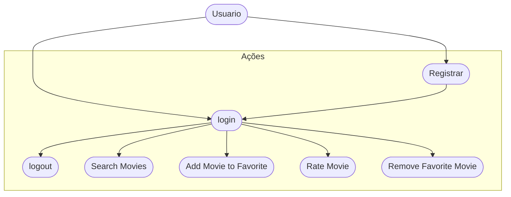
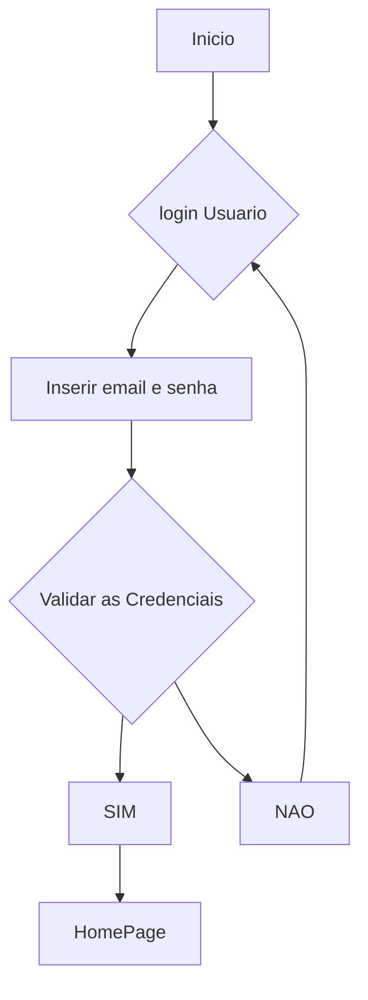

# Cine Favorite (Formativa)
Contruir um Aplicativo do Zero - O CineFavorite que permitirá criar uma conta e buscar filmes em uma API e montar uma galeria pessoal de filmes favoritos, com poster e nota avaliativa do usuário par o filme.

## Objetivos
- Criar uma Galeria Personalizada por Usuário de Filmes Favoritos
- Conectar o APP com uma API(base de dados) de Filmes (TMDB)
- Permitir a Criação de Contas para Cada Usuário
- Listar Filmes por Uma Palavra-Chave

## Levantamento de Requistos do Projeto
- ### Funcionais

- ### Não Funcionais

## Recursos do Projeto
- Linguagem de Programação : Flutter/Dart
- API TMDB: Base de Dados para Filmes
- Firebase: Authentication / FireStore
- Figma: Prototipagem 
- VSCode
- GitHub

## Diagramas
1. Classe
Demosntrar o Funcionamento das Entidades do Sistema

- Usuário (User): classe já modelada pelo FirebaseAuth
    - Atributos: email, senha, uid
    - Métodos: login, registrar, logout

-Filmes Favoritos (FavoriteMovie): Classe Modelada pelo DEV
    - Atributos: id, título, PosterPath, Nota
    - Métodos: adicionar, remover, listar, atualizaNota (CRUD)

```mermaid

    classDiagram
        class User{
            +String uid
            +String email
            +String password
            +createUser()
            +login()
            +logout()
        }
        class Movie{
            +String id
            +String title
            +String posterPath
            +double rating
            +addFavorite()
            +removeFavorite()
            +updateRating()
            +getFavoriteMovies()
        }

        User "1"--"1+" Movie;
        "select"

```

2. ### Uso
Ação que os atores podem fazer
- Usuario (User):
    - Registrar
    - Login
    - Logout
    - Procurar filmes na api
    - Salvar filme aos favoritos
    - Dar nota aos filmes favoritos
    - Remover filme dos favoritos



3. ### Fluxo
Determinar o caminho percorrido pelo ator para executar uma ação

- Fluxo da ação de login



## Prototipagem
https://www.figma.com/design/K8xHf5NVilRuJ3uorqXmyu/Cinefavorite?node-id=0-1&t=OiMetDlBiS2hD6e9-1

## Codificação

- Service --> Conectar com a API
- Model --> Movie
- Controller - Firestore Data Base